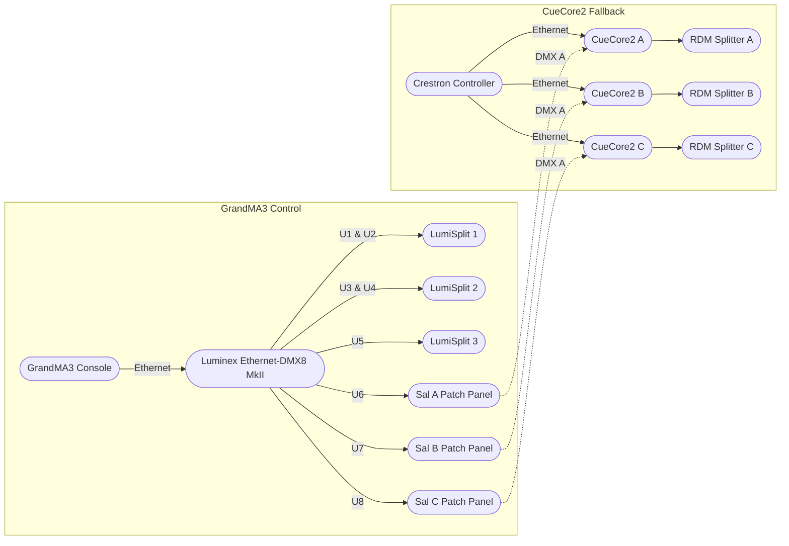

# System Components, Signal Flow, and Topology

**Source:** Topology.docx + Mermaid diagram from Cameron
**Last Verified:** 2026-01-21

---

## Core Devices

| Device | Function |
|--------|----------|
| GrandMA3 | Primary lighting console (Ethernet-based Art-Net/sACN) |
| Luminex Ethernet-DMX8 MkII | Converts Art-Net/sACN to 8 DMX universes (1–8) |
| LumiSplit 2.1 (×3) | Routes DMX outputs to up to 10 destinations each |
| CueCore2 (×3) | Per-room DMX controller for Crestron house lighting control |
| RdmSplitter (×3) | Breaks DMX from CueCore2 to 6 physical lines per room |
| Crestron Controller | Triggers scene playback on CueCore2 devices |

---

## Control Logic

- **Primary control:** GrandMA3 lighting desk (connected via Ethernet to Luminex)
- **Fallback control:** CueCore2 devices activate when Luminex U6/7/8 outputs are **disconnected** from the Sal patch panels
- **Crestron:** Triggers scene playback on CueCore2 devices
- **CueCore2 outputs:** Routed to room fixtures via dedicated RdmSplitters

### Universe Control Paths

| Universes | Control |
|-----------|---------|
| 1–5 | Always under GrandMA3 control |
| 6–8 | Dual-path: GrandMA3 (when patched) OR CueCore2 (when unpatched) |

**Patch panel determines control path:**
- **Patched** = GrandMA3 control
- **Unpatched** = CueCore2 (Crestron) control

---

## Signal Flow Diagram

---

## Physical Routing

### Luminex Ethernet-DMX8 MkII

| Connection | Destination |
|------------|-------------|
| Ethernet I | Ethernet patch panel → lighting desk/controller |
| Ethernet II | Technical system network/VLAN |
| DMX 1–5 | LumiSplits (U1–U5) |
| DMX 6 | Sal A patch panel (when patched) |
| DMX 7 | Sal B patch panel (when patched) |
| DMX 8 | Sal C patch panel (when patched) |

### CueCore2 Connections (per device)

| Connection | Purpose |
|------------|---------|
| Ethernet | System network (for Crestron control) |
| DMX A (input) | From Sal patch panel (GrandMA3 via Luminex) |
| DMX B (output) | To room-specific RdmSplitter |

---

## CueCore2 Role in Signal Flow

Each CueCore2 manages a dedicated room:

| Room | Universe | CueCore2 Input | CueCore2 Output |
|------|----------|----------------|-----------------|
| Sal A | 6 | DMX A ← Sal A patch | DMX B → RdmSplitter A → Sal A DMX lines |
| Sal B | 7 | DMX A ← Sal B patch | DMX B → RdmSplitter B → Sal B DMX lines |
| Sal C | 8 | DMX A ← Sal C patch | DMX B → RdmSplitter C → Sal C DMX lines |

---

## Universe to LumiSplit Routing

| LumiSplit | Universes |
|-----------|-----------|
| LumiSplit 1 | U1, U2 |
| LumiSplit 2 | U3, U4 |
| LumiSplit 3 | U5 |

*(U6–U8 go directly to Sal patch panels, not through LumiSplits)*

---

## DMX Line → Universe Map

Exhaustive list of all DMX lines. `?` = unknown, needs confirmation.

| Line | Universe | Destination | Notes |
|------|----------|-------------|-------|
| 1 | ? | | |
| 2 | ? | | |
| 3 | ? | | |
| 4 | ? | | |
| 5 | ? | | |
| 6 | ? | | |
| 7 | ? | | |
| 8 | ? | | |
| 9 | ? | | |
| 10 | ? | | |
| 11 | ? | | |
| 12 | ? | | |
| 13 | ? | | |
| 14 | ? | | |
| 15 | ? | | |
| 16 | ? | | |
| 17 | U2 | Truss 1 | Sal A moving lights + XBARs |
| 18 | — | (open) | Spare on Truss 1 |
| 19 | U3 | Truss 5 | Sal B |
| 20 | — | (open) | Spare on Truss 5 |
| 21 | U1 | Truss 2 | Sal A conventionals |
| 22 | — | (open) | Spare on Truss 2 |
| 23 | U1 | Truss 3 | Sal A conventionals |
| 24 | — | (open) | Spare on Truss 3 |
| 25 | U3 | Truss 4 | Sal B |
| 26 | — | (open) | Spare on Truss 4 |
| 27 | U3 | Truss 6 | Sal C |
| 28 | — | (open) | Spare on Truss 6 |
| 29 | U3 | Truss 7 | Sal C |
| 30 | — | (open) | Spare on Truss 7 |
| 31 | U4 | Pipe | Auras over stage |
| 32 | U6? | RdmSplitter A | House lights Sal A (placeholder) |
| 33 | U6? | RdmSplitter A | House lights Sal A (placeholder) |
| 34 | U6? | RdmSplitter A | House lights Sal A (placeholder) |
| 35 | U6? | RdmSplitter A | House lights Sal A (placeholder) |
| 36 | U6? | RdmSplitter A | House lights Sal A (placeholder) |
| 37 | U6? | RdmSplitter A | House lights Sal A (placeholder) |
| 38 | U7? | RdmSplitter B | House lights Sal B (placeholder) |
| 39 | U7? | RdmSplitter B | House lights Sal B (placeholder) |
| 40 | U7? | RdmSplitter B | House lights Sal B (placeholder) |
| 41 | U7? | RdmSplitter B | House lights Sal B (placeholder) |
| 42 | U7? | RdmSplitter B | House lights Sal B (placeholder) |
| 43 | U7? | RdmSplitter B | House lights Sal B (placeholder) |
| 44 | U8? | RdmSplitter C | House lights Sal C (placeholder) |
| 45 | U8? | RdmSplitter C | House lights Sal C (placeholder) |
| 46 | U8? | RdmSplitter C | House lights Sal C (placeholder) |
| 47 | U8? | RdmSplitter C | House lights Sal C (placeholder) |
| 48 | U8? | RdmSplitter C | House lights Sal C (placeholder) |
| 49 | U8? | RdmSplitter C | House lights Sal C (placeholder) |

---

## Universe → DMX Lines (Reverse Lookup)

| Universe | DMX Lines | Notes |
|----------|-----------|-------|
| U1 | 17, 21, 23 | Sal A conventionals (Truss 1, 2, 3) |
| U2 | 17 | Sal A moving lights (Truss 1) |
| U3 | 19, 25, 27, 29 | Sal B + C truss (Truss 4, 5, 6, 7) |
| U4 | 31 | Auras (Pipe) |
| U5 | ? | Unknown |
| U6 | 32–37? | House lights Sal A (via RdmSplitter A, placeholder) |
| U7 | 38–43? | House lights Sal B (via RdmSplitter B, placeholder) |
| U8 | 44–49? | House lights Sal C (via RdmSplitter C, placeholder) |
| ? | 1–16 | Unknown / need confirmation |
